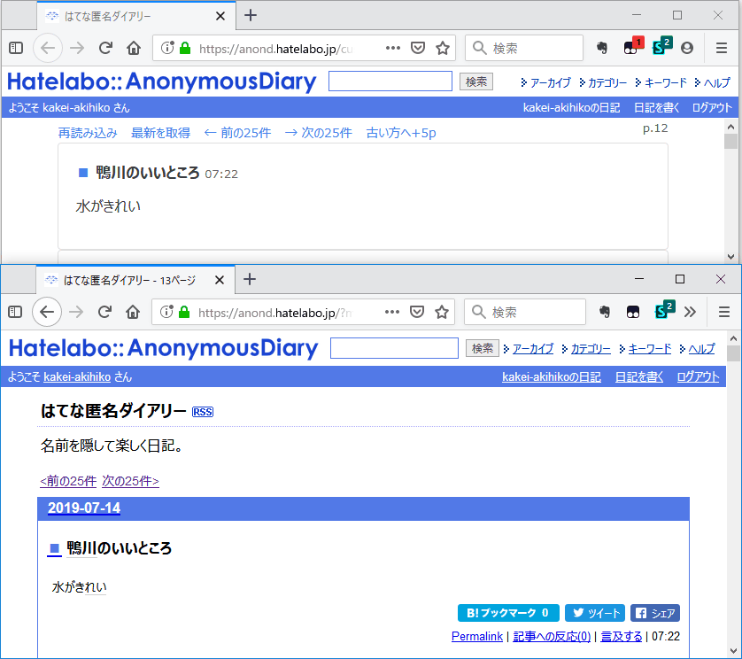

# カスタマイズ版匿名日記

## 使い方

1. Webブラウザーに[Tampermonkey](https://www.tampermonkey.net/)をインストールします。
2. `dist/index.js`の先頭に以下の文字列を追加します。

```
// ==UserScript==
// @name         カスタマイズ版匿名日記
// @namespace    http://tampermonkey.net/
// @version      3.0.0
// @description  try to take over the world!
// @author       You
// @match        https://anond.hatelabo.jp/customized
// @grant        none
// ==/UserScript==

```

3. JavaScriptファイルの内容をTampermonkeyに貼りつけて保存します。
4. https://anond.hatelabo.jp/customized にアクセスします。
5. 独自の画面が表示されます。

## スクリーンショット

上がユーザースクリプト適用版、下が通常の表示です。



## 初期設定・ビルド方法

```powershell
# package.jsonと同じフォルダに移動
Set-Location Path\To\Project\masuda

# 依存関係のインストール
yarn

# distに出力
yarn build
```
