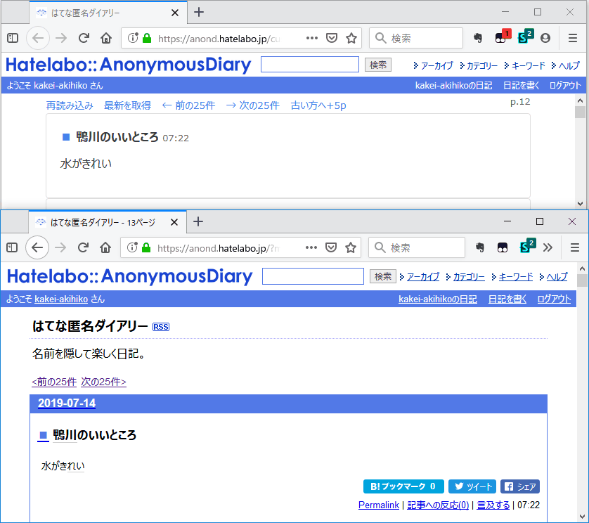

# カスタマイズ版匿名日記

## 使い方

1. Webブラウザーに[Tampermonkey](https://www.tampermonkey.net/)をインストールします。
1. `public/UserScript.js`の中身をTampermonkeyのユーザースクリプトとして追加します。
1. https://anond.hatelabo.jp/customized にアクセスします。
1. 独自の画面が表示されます。

## スクリーンショット

上がユーザースクリプト適用版、下が通常の表示です。



## ビルド方法

```
yarn run webpack
```

※ `Error: error:0308010C:digital envelope routines::unsupported`が発生する場合は環境変数`NODE_OPTIONS=--openssl-legacy-provider`を設定します。
